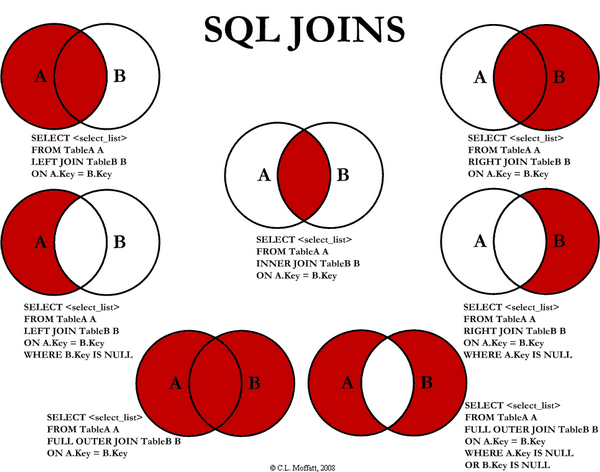

# 1. MySQL 아키텍처


## 1.1 MySQL 엔진
요청된 SQL 문장을 분석하거나 최적화하는 등 **DBMS의 두뇌에 해당하는 처리**를 수행

- 커넥션 핸들러: 클라이언트로부터의 접속 및 쿼리 요청을 처리
- SQL 파서 및 전처리기: SQL을 분해하여 처리
- 옵티마이저: 쿼리의 최적화 된 실행을 도움

## 1.2 스토리지 엔진
실제 데이터를 디스크 스토리지에 저장하거나 디스크 스토리지로부터 데이터를 읽어오는 부분을 수행

### 1.2.1 MyISAM
- Table Level Locking으로 CUD시 Table전체 락이 걸려 Write가 많은 서비스에 불리
- 소수의 사용자들이 데이터를 생성하고 유저들이 읽기만 하는 서비스에 유리

### 1.2.2 InnoDB
- **높은 신뢰성과 고성능**의 균형을 갖춘 범용 스토리지 엔진
- MySQL 5.5 이후부터 기본 스토리지 엔진으로 설정됨.

    #### 1.2.2.1 InnoDB의 장점
  - DML 작업은 사용자 데이터를 보호하기 위해 커밋, 롤백 및 충돌 복구 기능을 갖춘 트랜잭션을 사용하는 ACID 모델을 따름(원자성, 일관성, 격리성, 영속성)
  - 행 수준 잠금과 일관된 읽기는 다중 사용자 동시성 및 성능을 향상
  - 기본 키를 기반으로 쿼리를 최적화하기 위해 디스크의 데이터를 정렬
  - 데이터 무결성을 위해 외래 키 제약 조건을 지원


   #### 1.2.2.2 프라이머리 키 클러스터링
  - 프라이머리 키 값의 순서대로 디스크에 저장됨
  - 프라이머리키 = 클러스터링 인덱스 이기에 레인지 스캔이 상당히 빠르게 처리될 수 있음.

   #### 1.2.2.3 외래 키 지원
  - 데이터 무결성을 지킬 수 있으나 부모 테이블과 자식 테이블에도 인덱스가 생기고 잠금이 여러 테이블로 전파되어 주의해서 개발해야함.

   #### 1.2.2.4 MVCC
  - 레코드 레벨의 트랜잭션을 지원하는 DBMS가 제공하는 기능
  - MVCC의 가장 큰 목적은 잠금을 사용하지 않는 일관된 읽기를 제공(언두 로그를 통해)
  - 커밋 되기 이전에 변경 되기 이전의 내용을 보관하고 있는 언두 영역의 데이터를 반환

   #### 1.2.2.5 잠금 없는 일관된 읽기
  - MVCC를 이용해 잠금을 걸지 않고 읽기 작업을 수행
  - 다른 트랜잭션이 가지고 있는 잠금을 기다리지 않고 읽기 가능(순수한 SELECT문만)

   #### 1.2.2.6 InnoDB 버퍼 풀
  - 디스크의 데이터 파일이나 인덱스 정보를 메모리에 캐시해 두는 공간
  - 쓰기 작업을 지연시켜 일괄 작업으로 처리할 수 있게 해주는 버퍼 역할도 함
  - LRU를 통해 버퍼 풀에서 사용 빈도가 낮은 데이터 페이지들을 제거


## 2. 쿼리동작 방식


### 2.1 쿼리 파서
- 쿼리 파서는 사용자 요청으로 들어온 쿼리 문장을 토큰으로 분리해 트리 형태의 구조로 만듦
- 기본 문법의 오류는 이 과정에서 발견되어 사용자에게 오류 메시지 전달

### 2.2 전처리기
- 파서 과정에서 만들어진 파서 트리를 기반으로 쿼리 문장에 구조적인 문제점이 있는지 확인
- 각 토큰을 테이블 이름이나 칼럼 이름, 내장 함수와 같은 객체를 매핑하여 해당 객체의 존재 여부와 객체의 접근 권한 등을 확인하는 과정
- 실제 존재하지 않거나 권한상 사용할 수 없는 개체의 토큰은 이 단계에서 걸러짐

### 2.3 옵티마이저
- 사용자의 요청으로 들어온 쿼리 문장을 저렴한 비용으로 가장 빠르게 처리할지를 결정하는 역할을 담당하며 DBMS의 두뇌에 해당

### 2.4 실행 엔진(쿼리 실행기)
- 윗 단계에서 만들어진 계획대로 각 핸들러에게 요청해서 받은 결과를 또 다른 핸들러 요청의 입력으로 연결하는 역할 수행

### 2.5 핸들러(스토리지 엔진)
- 실행 엔진의 요청에 따라 데이터를 디스크로 저장하고 디스크로부터 읽어오는 역할을 담당.
- 핸들러는 스토리지 엔진을 의미

# Join
Join은 데이터베이스 내의 여러 테이블에서 가져온 레코드를 조합하여 하나의 테이블이나 결과 집합으로 표현해주는 것



## (INNER) JOIN
- 서로 조인하는 테이블의 ON 절의 조건이 일치하는 결과만 출력
```
SELECT u.userid
FROM user AS u INNER JOIN buy AS b
ON u.userid = b.userid
```

## LEFT / RIGHT / FULL OUTER JOIN
- 조인하는 테이블의 ON 절의 조건 중 한쪽의 데이터를 모두 가져옴
- FULL OUTER JOIN의 경우 대부분의 DB가 지원하지 않아서 UNION으로 처리하기도 함.

```
SELECT u.userid
FROM user AS u LEFT(RIGHT, FULL) OUTER JOIN buy AS b
ON u.userid = b.userid
```

## UNION
- 여러 개의 SELECT 문의 결과를 하나의 테이블이나 결과 집합으로 표현할 때 사용
- 선택된 필드의 개수와 타입이 모두 같아야하고, 필드의 순서도 같아야 함.
- 중복제거가 자동 포함되어있음.

## UNION ALL
- 중복되는 레코드까지 출력하고 싶을 경우 사용

```
SELECT 필드이름 FROM 테이블이름
UNION (ALL)
SELECT 필드이름 FROM 테이블이름
```

## EXCLUSIVE LEFT JOIN
- 어느 특정 테이블에 있는 레코드만 가져오는 것
- 별도의 함수가 있는 것이 아니고 LEFT JOIN과 WHERE 절의 조건을 함께 사용하여 만드는 JOIN 문법
  
```
SELECT * 
FROM table1 A LEFT JOIN table2 B
ON A.ID_SEQ = B.ID_SEQ 
WHERE B.ID_SEQ IS NULL 
```

## SELF JOIN
- 테이블 자기 자신을 조인 한 것
```
SELECT E.EMPNAME as 사원, M.EMPNAME as 직속상관
FROM EMPLOYEE E, EMPLOYEE M -- inner join
WHERE E.MANAGER = M.EMPNO;
```


# 질문 정리
1. MySQL의 아키텍처에 대해서 설명해보세요.
   - MySQL은 크게 MySQL엔진과 스토리지 엔진으로 이루어져있습니다. MySQL엔진은 요청 받은 쿼리를 파싱, 분석, 최적화하는 DBMS의 두뇌 역할을 하고 스토리지 엔진은 실제 데이터를 디스크 스토리지에 저장하거나 스토리지에서 가져오는 역할을 합니다.

2. MySQL엔진에는 어떤 것이 있나요?
   - MySQL엔진에는 쿼리를 파싱해주고 처리하는 쿼리 파서와 전처리기, 클라이언트로 부터의 접속 및 쿼리 요청을 처리하는 커넥션 핸들러, 쿼리의 최적화를 도와주는 옵티마이저가 있습니다. MySQL엔진은 전체적으로 쿼리에 대한 분석, 파싱, 최적화하는 DBMS의 두뇌 역할을 맡고 있습니다.

3. 스토리지 엔진이 하는 역할이 무엇이고 InnoDB의 장점이 무엇인지 설명해주세요.
   - 스토리지 엔진은 실제 데이터를 디스크에 저장하거나 가져오는 역할을 합니다. 스토리지 엔진은 크게 InnoDB와 MyISAM으로 나뉘는데요. InnoDB의 장점으로는 DML 작업에 트랜잭션을 사용하는 ACID 모델을 따라서 트랜잭션이 안전하게 수행된다는 점과 행 수준의 잠금과 일관된 읽기로 다중 사용자 동시성 및 성능을 향상 시킵니다. 또한 디스크의 데이터를 정렬하여 쿼리를 최적화 하고, 데이터 무결성을 위해 외래 키 제약 조건을 지원합니다.

4. MVCC가 무엇인지 설명해주세요.
   - MVCC는 레코드 레벨의 트랜잭션을 지원하는 기능으로 잠금을 사용하지 않는 일관된 읽기를 언두 로그를 통해 제공합니다. 커밋되기 이전에 변경 되기 이전의 내용을 보관하고 있는 언두 영역의 데이터를 반환하며 잠금을 필요로 하지 않기 때문에 일반적인 DBMS보다 빠릅니다.

5. 버퍼 풀의 역할이 무엇인지 설명해주세요.
   - 디스크의 데이터나 인덱스 정보를 메모리에 캐시해두는 용도 또는 쓰기 작업을 지연시켜 일괄 작업으로 처리할 수 있게 해주는 버퍼 역할을 합니다. LRU 기법을 통해 제일 많이 사용되지 않은 페이지는 삭제 처리됩니다.

6. 쿼리의 동작 방식에 대해서 설명해주세요.
첫번째로 SQL 쿼리 요청이 들어오면 쿼리 파서가 해당 쿼리를 파싱하여 트리 형태로 만듭니다. 이때 문법적 오류를 잡아내어 사용자에게 알려줍니다. 두번째 파싱된 이후의 트리에서 쿼리 문장에 구조적인 문제 예를 들어 테이블 이름, 칼럼 이름, 내장 함수와 같은 객체를 매핑하여 존재 여부 등을 확인합니다. 세번째 옵티마이저가 쿼리 문장을 저렴한 비용으로 가장 빠르게 처리할 수 있도록 결정하는 일을 진행합니다. 네번째 실행 엔진이 이전까지 작업이 완료된 계획대로 각 핸들러에게 요청해서 받은 결과를 또 다른 핸들러 요청의 입력으로 연결하는 역할을 수행합니다. 마지막으로 핸들러 즉 스토리지 엔진이 데이터를 디스크로 저장하거나 디스크로부터 읽어오는 역할을 수행하면서 끝이 납니다.


7. 조인의 종류에 대해서 설명해주세요.
조인은 데이터베이스 내의 여러 테이블에서 가져온 레코드를 조합하여 하나의 테이블이나 결과 집합으로 표현해주는 것이며 종류로는 Inner Join, LEFT/RIGTH/FULL OUTER JOIN, UNION, EXCLUSIVE LEFT JOIN, SELF JOIN이 있습니다. Inner Join은 말그대로 두 테이블에서 겹치는 데이터만 출력하는 join이고 LEFT/RIGHT 조인은 ON 절의 조건과 LEFT/RIGHT 방향에 따라 해당하는 방향쪽의 데이터를 모두 가져옵니다. OUTER JOIN은 모든 데이터들의 집합을 출력하는 조인이고, UNION은 여러 개의 SELECT 문의 결과를 하나로 합칠 때 사용하며 컬럼의 개수, 순서가 모두 일치해야만 합니다. EXCLUSIVE LEFT JOIN의 경우 한쪽 데이터 즉 차집합을 의미하고, SELF JOIN은 말 그대로 자기 자신 테이블을 조인한 것입니다.