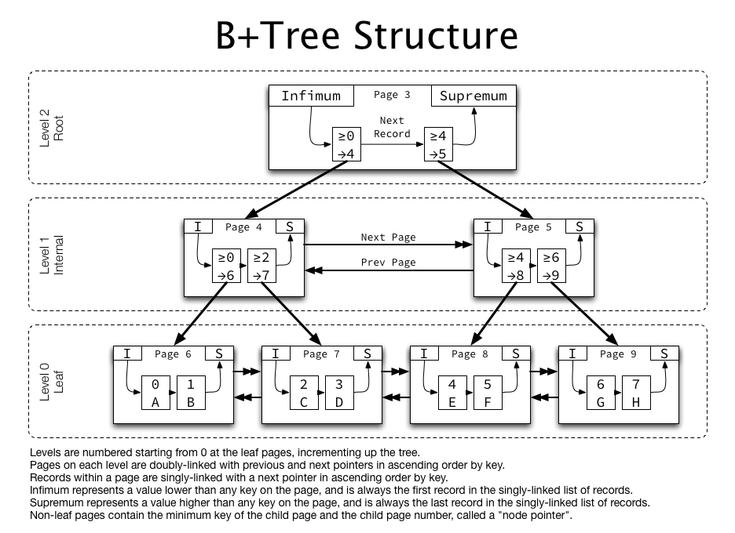

# 04. Index

## Keyword

### Index

#### 인덱스 개념

> 인덱스란 추가적인 쓰기작업 그리고 저장공간을 활용해 데이터베이스의 검색 속도를 향상시키기 위한 자료구조이다.
>
> 데이터베이스에서도 테이블의 모든 데이터를 검색하면 시간이 오래 걸리므로, 데이터와 데이터의 위치를 포함한 자료구조를 생성해 빠르게 조회할 수 있도록 돕고 있다.
>
> 장점 
>
> - 테이블을 조회하는 속도와 그에 따른 성능을 향상시킬 수 있다. 
> - 전반적인 시스템 부하를 줄일 수 있다.
>
> 단점
>
> - 인덱스를 관리하기 위해 DB의 약 10%에 해당하는 저장공간이 필요하다.
> - 인덱스를 관리하기 위해 추가작업이 필요하다.
> - 인덱스를 잘못 사용할 경우 오히려 성능이 안좋아 질 수 있다.
>
> 인덱스를 사용하면 좋은 경우 
>
> - 규모가 작지 않은 테이블
> - 데이터의 변경이 자주 일어나지 않는 테이블 (INSERT, UPDATE, DELETE)
> - JOIN, WHERE, ORDER BY에 자주 사용되는 컬럼
> - 카디널리티가 높고, 선택도가 낮은 컬럼

#### 인덱스 종류 

> Primary Index vs Secondary Index
>
> > Primary Index 
> >
> > - PK 기반으로 만들어진 인덱스 
> > - PK는 하나만 가질 수 있으므로 Primary Index도 단 하나만 존재한다.
> >
> > Secondary Index 
> >
> > - 기본키는 아니지만 성능 향상을 위해 임의의 컬럼을 지정해 만든 인덱스
> > - 여러개의 Secondary Index가 존재 할 수 있다. 

#### Clustered Index, Non-Clustered Index

> Clustered Index
>
> - 테이블당 1개씩만 허용
> - 물리적으로 행 재배열
> - PK설정 시 자동으로 Clustered Index가 만들어진다
> - 인덱스 자체의 리프 페이지가 데이터이다. (인덱스 페이지를 별도로 만들지 않는다.)
> - 데이터 입력, 수정, 삭제 시 항상 정렬 상태를 유지한다
> - 데이터 검색 : Non Clustered Index보다 빠르다
> - 데이터 입력, 수정, 삭제 ; Non Clustered Index보다 느리다
> - 30% 이내에서 사용해야 좋은 선택도를 가진다
>
> Non-Clustered Index
>
> - 데이터 위치 : 페이지 번호 + #오프셋 으로 기록됨
> - 테이블당 240개의 인덱스 허용
> - 인덱스 페이지는 로그파일에 저장
> - 레코드의 원본은 정렬되지 않고, 인덱스 페이지만 정렬된다
> - 인덱스 생성시 데이터 페이지는 그냥 둔 상태로 인덱스 페이지를 별도로 생성해야 하므로 용량을 차지한다
> - 3% 이내에 사용해야 좋은 선택도를 가진다. 
>
> ***ClusteredIndex : 책의 페이지를 알아서 페이지를 바로 펼수있다.***
>
> ***Non-ClusteredIndex : 책의 목차를 통해 페이지를 찾아내고 페이지를 펼 수 있다.***

#### 인덱스 자료구조

> 인덱스를 구현하기 위해 다양한 자료구조를 사용할 수 있으나 그 중 Hash Table, B+Tree에 대해서 정리
>
> **Hash Table**
>
> > 해시테이블은 빠른 데이터 검색이 필요할 때 유용하다. 
> >
> > 해시테이블은 Key값을 이용해 고유한 Index를 생성해 그 index에 저장된 값을 꺼내오는 구조이다.
> >
> > 해시테이블의 시간 복잡도는 O(1)으로, 매우 빠른 데이터 검색을 지원한다.
> >
> > 하지만 DB 인덱스에서는 사용이 매우 제한적이다. 
> >
> > 해시는 등호(=) 연산에만 특화되어있다. 데이터베이스에서 부등호 연산(< , >)이 자주 사용되는 데이터베이스 검색의 경우 해시테이블은 이점을 얻지 못한다. 
>
> **B+Tree**
>
> > 자식 노드가 두개 이상인 B-Tree를 개선시킨 자료구조이다. 
> >
> > B+Tree의 경우 다음과 같은 특성을 지닌다.
> >
> > - 리프노드만 인덱스와 함께 데이터(value)를 지니고, 나머지 노드들은 데이터를 위한 인덱스만(key)을 갖는다.
> > - 리프 노드들은 LinkedList로 연결되어 있다.
> > - 데이터 노드 크기는 인덱스 노드의 크기와 같지 않아도 된다.
>
> 

---

## Questions 

1) 인덱스에 대해서 설명해주세요.
2) 인덱스는 어떤 컬럼에 적용하면 좋나요?
3) Clustered Index와 Non-Clustered Index의 차이에 대해서 설명해주세요.
4) 인덱스 자료구조 중 Hash Tbale, B+Tree 구조에 대해서 설명해주세요.

---

참고 사이트 : https://mangkyu.tistory.com/96