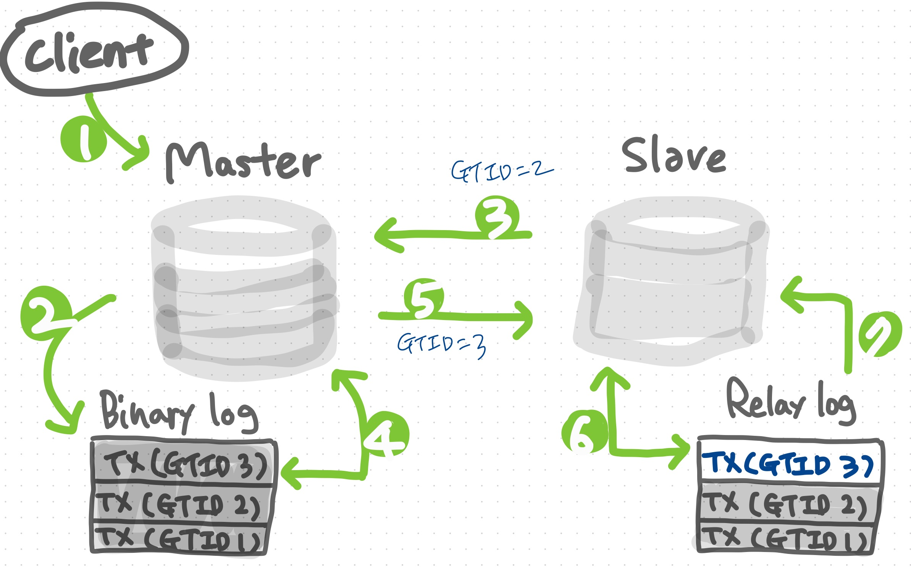
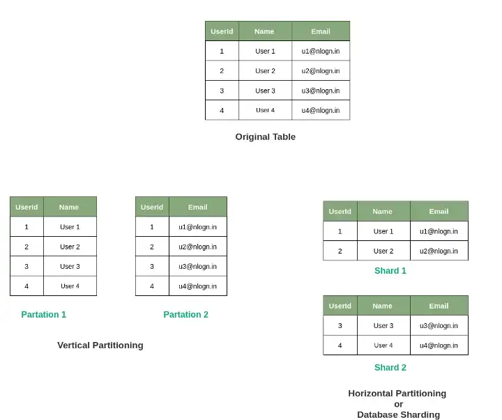

## Master/Slave

> MySQL에서는 데이터가 날아가는 것을 방지하기 위해 Master-Slave구조를 종종 사용한다. 
>
> Master : 
>
> - 등록 / 수정 / 삭제 쿼리 요청이 있을 겨웅 Binary Log 를 생성해 Slave로 전달.
>
> Slave : 
>
> - Master의 정보를 복제하는 역할을 담당.
> - 읽기 쿼리 요청을 담당.
>
> Replication 과정 
>
> 
>
> 1. Client 의 쓰기 쿼리작업 요청 
> 2. Master에서 변경사항을 Binary log에 기록
> 3. Slave에서 현재까지 기록한 이벤트를 기반으로 Master에게 다음 이벤트 정보 요청
> 4. Binary log 파일에서 최신 이벤트 정보를 읽어온다.
> 5. 4과정에서 읽어온 최신 이벤트 정보를 Slave에게 전송
> 6. Master에게 받은 정보를 Relay log에 저장
> 7. Slave에서 최종 변경사항을 DB에 반영

## Sharding

> 샤딩이란 데이터를 효율적으로 분산 시키는 것을 말한다. 
>
> 분산이 잘 되지 않는다면 한쪽으로 Data가 몰리게되며, 성능과 관련된 이슈가 발생한다. 
>
> 
>
> 분할의 경우 수직 분할과 수평 분할이 존재한다. 
>
> 수직 분할 
>
> > 한 스키마에 저장되어 있는 데이터를 특정 Column단위로 잘라내 분할 저장.
> >
> > 논리적으로 엔티티들을 다른 물리 엔티티들로 나누는 것을 의미한다. 
>
> 수평 분할
>
> > 한 스키마에 저장되어 있는 데이터를 특정 알고리즘을 통해 행 단위로 잘라내 분할 저장. 수평분할은 하나로 구성된 스키마를 동일한 여러개의 스키마로 분리 후, 각 스키마에 어떤 데이터가 저장될 지를 샤드 키를 기준으로 분리한다. 

## NoSQL

### NoSQL의 개념

> NoSQL은 대량의 구조화되지 않은 데이터를 빠르고 효율적으로 처리할 수 있다
>
> 특징 
>
> - 스케일 아웃 : 수평적으로 확장이 가능하다. 
> - 유연한 스키마 : 고정된 스키마가 없어 데이터 형식을 자유롭게 저장할 수 있다.
> - 높은 성능 : 대량의 데이터를 빠르게 읽고 쓸 수 있다. 
>
> 종류
>
> - **Document Stores**: MongoDB, Couchbase
> - **Key-Value Stores**: Redis, DynamoDB
> - **Column-family Stores**: Cassandra, HBase
> - **Graph Databases**: Neo4j, Amazon Neptune
>
> 장점 
>
> - 빠른 읽기/쓰기 속도
> - 수평적 확장 용이
>
> 단점
>
> - 일관성을 희생할 수 있다
> - 복잡한 쿼리 미지원 

### RDB VS NoSQL

|                  | RDB (SQL)                                                    | NoSQL                                                        |
| ---------------- | ------------------------------------------------------------ | ------------------------------------------------------------ |
| 데이터 저장 모델 | table                                                        | json document / key-value / 그래프 등                        |
| 개발 목적        | 데이터 중복 감소                                             | 애자일 / 확장가능성 / 유연성                                 |
| 예시             | Oracle, MySQL, PostgreSQL 등                                 | MongoDB, DynamoDB 등                                         |
| Schema           | 엄격한 데이터 구조                                           | 유연한 데이터 구조                                           |
| 장점             | - 명확한 데이터구조 보장 - 데이터의 중복 방지 (무결성) 데이터 update가 용이 | - 유연하고 자유로운 데이터 구조 - 새로운 필드 추가 자유로움 - 수평적 확장 용이 |
| 단점             | - 시스템이 커지면 복잡한 쿼리 필요 - 수직적 확장이 주로 사용됨 - 데이터 구조가 유연하지 못함 | - 데이터 중복 발생 가능  - 중복데이터가 많기 때문에 데이터 변경 시 모든 컬렉션에서 수정 필요 -명확한 데이터 구조 보장 X |

### Redis 동작원리

> 클러스터 구동 시 노드별로 데이터를 저장할 수 있는 hashslot을 할당받는다. 
>
> 데이터 저장시 Redis 자체 해시 알고리즘에 의해 key에 맞는 hashslot이 선택되어 저장된다. 
>
> 데이터 조회 시 자체 해시 알고리즘에 의해 key에 맞는 hashslot에서 데이터를 읽어온다.

