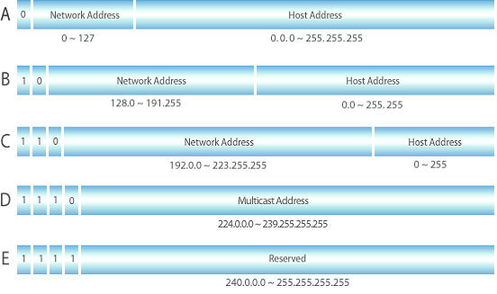

## OSI 7계층

> OSI 7계층이란 네트워크 프로토콜이 통신하는 구조를 7개의 계층으로 분리해 각 계층간 상호 작동하는 방식을 정해놓은 것이다. 
>
> OSI 7계층은 다음으로 이루어집니다. 
>
> 응용계층 / 표현 계층 / 세션 계층 / 전송 계층 / 네트워크 계층 / 데이터 링크 계층 / 물리 계층

## TCP/IP 4계층

> OSI 7계층 모델은 실무적으로 이용하기에 다소 복잡하기 때문에 이를 단순화한 계층이다. 
>
> TCP/IP 4계층은 다음으로 이루어집니다. 
>
> 응용 계층 / 전송 계층 / 인터넷 계층 / 네트워크 인터페이스 계층 

### 캡슐화(Encapsulation) & 역캡슐화(Decapsulation)

> 캡슐화란 통신 프로토콜의 특성을 포함한 정보를 Header에 포함시켜 하위 계층에 전송하는 것을 말한다. 
>
> 역캡슐화란 통신 상대측에서 Header를 역순으로 제거하면서 원래의 Data를 얻는 과정을 말한다. 

## IP

### IPv4 vs IPv6

> IPv4 : 네 도막으로 나눠진 최대 12자리의 번호로 이뤄진다. 
>
> e.g) 127.0.0.1 
>
> 각 도막마다 0 ~ 255까지의 숫자로 표현할 수 있다. 
>
> 기하 급수적으로 늘어나는 사용자의 수요를 봤을 때, 현재 IPv4 체계로는 계속해서 요구되는 인터넷 주소의 수요를 충족시킬 수 없기에 IPv6가 생겨났다. 
>
> IPv6 : 16비트씩 8부분으로 나누어 각 부분을 콜론 : 으로 구분하여 표현하며, 각 구분은 16진수로 표현한다. 
>
> e.g) 2010: 2302 : abcd : fecf : 0000 : 0000 : fdef : 1111

> |               | IPv4                     | IPv6                                                     |
> | ------------- | ------------------------ | -------------------------------------------------------- |
> | 주소길이      | 32 bit                   | 128bit                                                   |
> | 품질 제어     | 품질 보장 곤란           | 등급별, 서비스 별로 패킷을 구분할 수 있어 품질 보장 용이 |
> | 보안 기능     | IPsec 프로토콜 별도 설치 | 확장 기능에서 기본으로 제공                              |
> | 자동 네트워킹 | 곤란하다                 | 있다. (Auto Configuration)                               |
> | 이동성 지원   | 비효율적                 | 효율적                                                   |
>
> 

### subnet

> 서브넷은 큰 네트워크를 더 작은 단위로 나눈 것이다. 
>
> 서브넷을 사용하면 IP 주소 공간을 효율적으로 사용할 수 있고 네트워크 관리가 쉬워진다. 
>
> 서브넷은 주로 라우터에 의해 구분되며, 각 서브넷 내에서는 별도의 IP 주소 범위가 할당된다. 
>
> 이점
>
> 1. 주소 공간 효율성 : 큰 네트워크를 여러 개의 작은 서브넷으로 나누면, 필요한 만큼만 IP 주소를 할당할 수 있어 주소 공간을 효율적으로 사용할 수 있다. 
> 2. 보안 강화 : 서브넷을 사용하면 네트워크의 일부만을 고립시켜 보안을 강화할 수 있다. 
> 3. 라우팅 효율성 : 라우팅 테이블이 간단해져서 라우터의 처리 부하가 줄고, 라우팅이 더 빠르게 이루어진다. 
> 4. 네트워크 성능 개선 : 브로드캐스트 트래픽이 서브넷 내로 제한되므로, 네트워크의 전체적인 성능이 개선된다.

### CIDR(Classless Inter Domain Routing)

> 클래스 없는 도메인간 라우팅 기법이다. 
>
> 클래스는 CIDR이 나오기 전 사용했던 네트워크 구분 체계로 다음과 같이 구분한다. 
>
> 
>
> 도메인간 라우팅이란 다음 그림에서 Inter-Domain과 형태를 말한다. 
>
> 
>
> CIDR이란 Intra-Domain과 같이 각 네트워크 대역을 구분 짓고, Inter-Domainr과 같이 구분된 네트워크간 통신을 위한 주소체계이다. 
>
> CIDR을 통해 IP주소를 효율적으로 하당하고 라우팅 정보를 더 간결하게 표기할 수 있다. 
>
> **표기법**
>
> CIDR 표기법은 다음과 같이 사용된다. 
>
> 192.168.10.0/24 => 여기서 "/24" 가 사이더 표기법이다. 

---

## Questions

1. OSI 7 layer와 TCP / IP 4계층에 대해서 설명해주세요. 
2. 캡슐화와 역캡슐화에 대해서 설명해주세요.
3. IPv4 와 IPv6의 차이는 무엇인가요?
4. 서브넷이란 무엇인가요?
5. 서브넷 마스크와 CIDR의 개념에 대해서 설명해주세요.